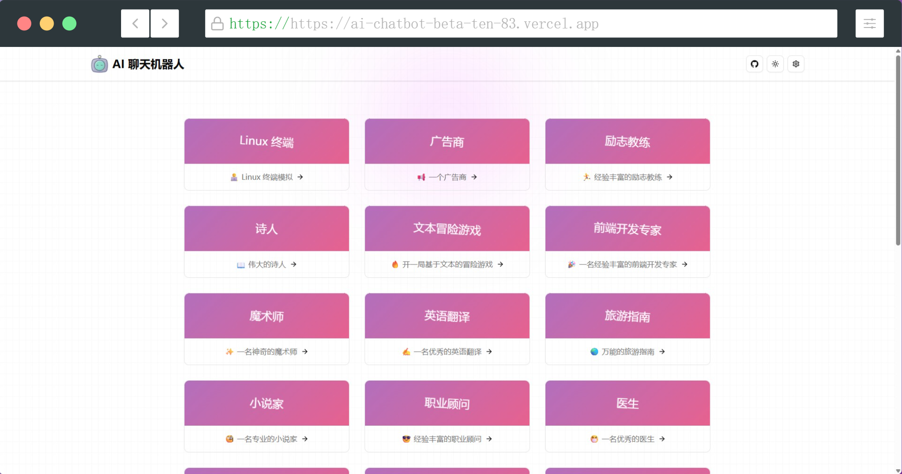

> 基于 Next.js 开发的多功能 AI 聊天机器人，支持多个 [AI 模型](https://github.com/liuyuhe666/ai-chatbot/blob/main/data/ai-sdk-providers.txt)，内置多种应用场景。

在线体验：[https://ai-chatbot-beta-ten-83.vercel.app](https://ai-chatbot-beta-ten-83.vercel.app)

## 🧩 截图

<table>
<tr>
<td></td>
<td></td>
</tr>
</table>

## 🧑‍💻 安装和运行

- 安装依赖

```bash
pnpm i
```

- 本地开发

```bash
pnpm dev
```

## 😎 定制

`fork` 该项目，修改 `data/chatbot.json`

```json
[
  {
    "id": 1,
    "name": "",
    "description": "",
    "prompt": ""
  }
]
```

## 📖 许可

[GNU General Public License v3.0](https://github.com/liuyuhe666/ai-chatbot/blob/main/LICENSE)

## 🌹 支持

如果你喜欢这个项目或发现有用，可以点右上角 [`Star`](https://github.com/liuyuhe666/ai-chatbot) 支持一下，你的支持是我们不断改进的动力，感谢！ ^_^

## 📚 参考资料

- [https://github.com/PlexPt/awesome-chatgpt-prompts-zh](https://github.com/PlexPt/awesome-chatgpt-prompts-zh)
- [https://sdk.vercel.ai](https://sdk.vercel.ai)
